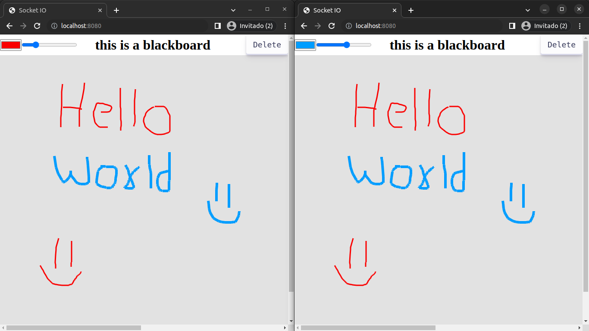

# Socket-Blackboard-NodeJS

## Descripción

Socket-Blackboard-NodeJS es un proyecto basado en Node.js y Socket.io que proporciona un pizarrón interactivo en tiempo real. Esta aplicación permite a los usuarios dibujar y colaborar en un tablero compartido utilizando capacidades de dibujo en lienzo y comunicación en tiempo real mediante sockets.

### Características principales:
- Interfaz intuitiva de pizarra donde los usuarios pueden dibujar y escribir.
- Compartición instantánea de trazos y cambios en tiempo real entre múltiples usuarios.
- Integración de Socket.io para la comunicación bidireccional en tiempo real.
- Opciones de personalización, incluyendo selección de colores y grosor de trazos.

Este repositorio contiene el código fuente del servidor Node.js y el cliente web necesario para ejecutar la aplicación. Proporciona una base sólida para construir y ampliar una pizarra colaborativa en tiempo real utilizando tecnologías de sockets y Node.js.

